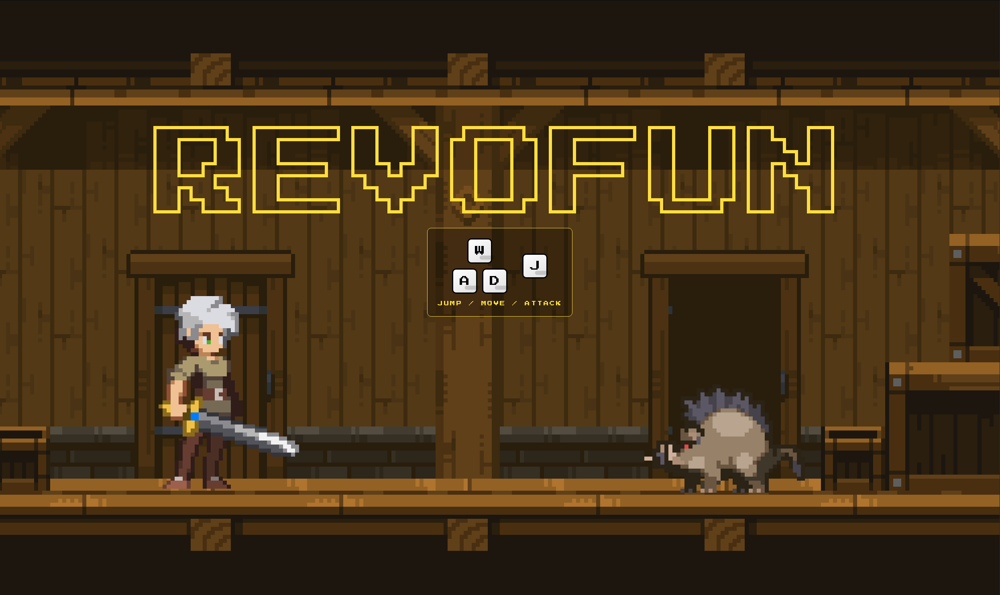

# REVOFUN - Interactive Browser-Based Gaming Platform


## Accessing the Website
### [Visit the Live Site Here!](https://mrafiasyifaa.github.io/milestone-2-mrafiasyifaa/)



## Future Development Plans

The following improvements are planned for future iterations:

- Truth be told, I'm still learning core logic with JavaScript ecosystem
- Add more mini-games to expand the game collection
- Revamp the overall concept and design to be more thematically consistent
- Connect leaderboard system to a simple backend service, possibly using Supabase for real-time data persistence
- Deploy website with self-hosting method with tools like DigitalOcean, Coolify, and Domain.com

## Project Overview

REVOFUN is an engaging browser-based gaming platform that combines an interactive 2D platformer with a collection of mini-games. The platform features a unique user experience flow where players are introduced through an action-packed platformer game that captures their name, then redirects them to a comprehensive landing page showcasing additional games, leaderboards, and community features.

The website demonstrates modern web development practices with semantic HTML structure, responsive CSS design, and interactive JavaScript functionality. All games are designed to run entirely in the browser without requiring any server-side processing or external dependencies.

## Technologies and Tools

### Core Technologies

- HTML5: Semantic markup and Canvas API for 2D game rendering
- CSS3: Custom properties (CSS variables), Flexbox, responsive design, and theme consistency
- JavaScript ES6+: Modular code structure, DOM manipulation, localStorage API, and game logic

### Development Tools

- Visual Studio Code: Primary code editor
- Git: Version control system
- GitHub: Repository hosting and collaboration

### External Resources

- Google Fonts: Press Start 2P (pixel-style font) and Orbitron (modern sans-serif)
- Custom Assets: Pixel art sprites, background images, sound effects, and collision maps

### Browser APIs Utilized

- Canvas API: 2D rendering context for platformer game
- Web Audio API: Sound effects and audio playback
- localStorage API: Client-side data persistence for player names and leaderboards
- DOM API: Dynamic content updates and user interactions

### Local Development

To run the project locally:

1. Clone the repository:
   ```
   git clone https://github.com/mrafiasyifaa/milestone-2-mrafiasyifaa.git
   ```

2. Navigate to the project directory:
   ```
   cd milestone-2-mrafiasyifaa
   ```

3. Open the project with a local server. You can use:
   - VS Code Live Server extension
   - Python: `python -m http.server 8000`
   - Node.js http-server: `npx http-server`

4. Open your browser and navigate to `http://localhost:8000` (or appropriate port)

Note: The project requires a local server due to ES6 module imports and asset loading. Opening index.html directly in a browser will not work due to CORS restrictions.

## Features

### 1. Interactive 2D Platformer (Entry Point)

- Canvas-based game rendering with pixel art aesthetics
- Player character with smooth movement controls (W/A/D keys)
- Attack mechanics with hitbox detection (J key)
- Enemy AI with collision detection and knockback physics
- Dynamic camera system with shake effects on impact
- Progressive HUD system displaying REVOFUN text that fills as players defeat enemies
- Sound effects for attacks and enemy hits
- Victory condition triggering modal for name capture

### 2. Custom Victory Modal

- Non-intrusive modal overlay for capturing player name
- Input validation ensuring proper name format
- localStorage integration for persistent data across pages
- Smooth transition to landing page after name submission

### 3. Themed Landing Page (home.html)

- Personalized greeting using captured player name
- Sticky navigation header with smooth scroll anchoring
- Hero section with clear value proposition
- Consistent theme matching the platformer aesthetic
- Responsive layout adapting to different screen sizes

### 4. Our Games Section

- Three distinct mini-games showcased with descriptions:
  - Rock Paper Scissors: Classic hand game against computer AI
  - Speed Clicker: Reaction time challenge
  - Number Guessing Game: Logic and deduction game with attempts tracking
- Clean card-based layout with hover effects
- Direct links to individual game pages

### 5. Number Guessing Game

- Random number generation between 1-100
- Input validation preventing invalid guesses
- Feedback system (too high, too low, correct)
- Attempts counter with 10-attempt limit
- Previous guesses display for player reference
- Win/loss state management with game statistics
- Play again functionality without page reload
- Themed styling consistent with main platform

### 6. Leaderboards System

- Three separate leaderboards for each mini-game
- localStorage-based score persistence
- Automatic loading and display of top scores
- Clean tabular presentation with rank, player name, and score

### 7. Contact Form

- Properly structured form with semantic HTML
- Required field validation on all inputs
- Appropriate input types:
  - Text input for name
  - Email input for email address
  - Textarea for message content
- Accessible labels associated with each input field
- Submit button with hover effects

### 8. Tutorial Controls Overlay

- Visual keyboard guide (W/A/D + J keys)
- Flexbox-based layout matching physical keyboard arrangement
- Semi-transparent design not obstructing gameplay
- Helps new players understand controls immediately

## HTML Structure and Semantic Elements

### Proper Nesting and Hierarchy

All HTML files maintain strict nesting rules with no misplaced or unclosed tags. The document structure follows a clear hierarchy:

- H1 used for main page titles and primary headings
- H2 used for major section titles
- H3 used for subsection titles (game cards, form sections)
- Proper parent-child relationships maintained throughout

### Semantic Elements Usage

The website extensively uses HTML5 semantic elements to enhance accessibility and document structure:

- `<header>`: Site-wide navigation and greeting
- `<main>`: Primary content container
- `<section>`: Distinct content sections (hero, games, leaderboards, contact)
- `<article>`: Self-contained game cards
- `<nav>`: Navigation menu with accessibility labels
- `<footer>`: Site footer information
- `<form>`: Contact form with proper structure
- `<label>`: Associated with all form inputs for accessibility
- `<figure>`: Where applicable for game icons

### Code Organization

- Consistent indentation (2 or 4 spaces)
- Logical grouping of related elements
- Clear separation between sections
- Comments removed for production cleanliness
- Meaningful class names following BEM-like conventions

## Form Validation Implementation

The contact form includes multiple validation layers:

### HTML5 Native Validation

- `required` attribute on all input fields
- `type="email"` ensures proper email format
- `minlength` and `maxlength` constraints where appropriate

### Accessibility Features

- Every input has a corresponding `<label>` with `for` attribute
- Labels provide clear instructions for each field
- Form structure is keyboard-navigable
- Semantic HTML enhances screen reader compatibility

## CSS Architecture

### CSS Variables

Theme consistency is maintained through CSS custom properties defined in `:root`:

- `--color-primary`: Yellow accent color
- `--color-bg-dark`: Dark backgrounds
- `--color-wood-dark` and `--color-wood-light`: Wood-tone gradients
- `--font-pixel`: Pixel-style font family
- `--font-sans`: Modern sans-serif font family
- Spacing and border-radius variables for consistency

### Responsive Design

- Flexbox layouts for flexible content arrangement
- Media queries for mobile, tablet, and desktop breakpoints
- Fluid typography and spacing
- Mobile-first approach with progressive enhancement

### Visual Consistency

- Single background image across themed pages
- Semi-transparent overlays for improved text contrast
- Consistent button styling with hover and active states
- Smooth transitions for interactive elements

## JavaScript Architecture

### Modular Structure

- Game logic separated into distinct modules
- Reusable functions for common operations
- Clear separation of concerns

### localStorage Integration

- Player name persistence across sessions
- Leaderboard data storage and retrieval
- Automatic data loading on page load

### Game Logic Patterns

- State management for game flow
- Event-driven interactions
- Input validation and sanitization
- Dynamic DOM updates without page reloads

## Browser Compatibility

The website is tested and compatible with:

- Google Chrome (latest)
- Mozilla Firefox (latest)
- Microsoft Edge (latest)
- Safari (latest)

Note: Internet Explorer is not supported due to ES6 module usage and modern CSS features.

## Project Structure

```
milestone-2-mrafiasyifaa/
├── index.html                  # Platformer game (entry point)
├── index.css                   # Platformer game styles
├── index.js                    # Main game logic and imports
├── README.md                   # Project documentation
├── assets/                     # Game assets directory
│   ├── map/                   # Background and map images
│   ├── sounds/                # Audio files
│   └── sprites/               # Character and enemy sprites
├── js/                        # JavaScript modules
│   └── games/                 # Game-specific logic
│       └── number-guessing-game.js
└── pages/                     # Additional HTML pages
    ├── home.html              # Landing page
    ├── home.css               # Landing page styles
    ├── number-guessing-game.html  # Guessing game page
    └── number-guessing-game.css   # Guessing game styles
```

## Credits

- **Developer**: Muhammad Rafi A Syifaa
- **Studio**: REVOFUN Gaming Studio
- **Course**: Full-Stack Software Engineering
- **Institution**: RevoU

## License

This project is created for educational purposes as part of the RevoU Full-Stack Software Engineering program.

[](https://classroom.github.com/a/PAiQDgnZ)
